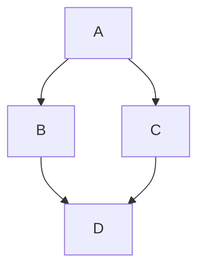

# [GitHub Shortcuts](https://docs.github.com/en/get-started/accessibility/keyboard-shortcuts)
* `?` brings up list of keyboard shortcuts on a given page

## Site-wide shortcuts
* `S` or `/`: focus the search bar
* `G + N`: go to notifications
* `Option` + `Up Arrow` : move focus from an element to its hovercard

## Repositories
* `G` + `C`: `Code` tab
* `G` + `I`: `Issues` tab
* `G` + `P`: `PR` tab
* `G` + `A`: `Actions` tab

## Source code editing
* `.` : Opens the repository / pull request in the `github.dev` editor (same browser tab)
* `>`: Opens the repository / pull request in the `github.dev` editor (new browser tab)
* `E`: Open source code file in the `Edit file` tab
* `Command` + `F`: search in file editor
* GitHub uses [CodeMirror shortcuts](https://codemirror.net/5/doc/manual.html#commands) for editing files

### Markdown
* `Command` + `E`: code one-liner
* `Command` + `Shift` + `7`: ordered list
* `Command` + `Shift` + `8`: unordered list
* `Command` + `Shift` + `.`: quote

#### [Footnotes](https://docs.github.com/en/get-started/writing-on-github/getting-started-with-writing-and-formatting-on-github/basic-writing-and-formatting-syntax#footnotes)
* Bracket syntax like `[^1]` inline and then at the bottom of the page `[^1]: some reference`

#### [Alerts](https://docs.github.com/en/get-started/writing-on-github/getting-started-with-writing-and-formatting-on-github/basic-writing-and-formatting-syntax#footnotes)
* `[!NOTE]`, `[!TIP]`, `[!IMPORTANT]`, `[!WARNING]` , `[!CAUTION]`

#### [Tables](https://docs.github.com/en/get-started/writing-on-github/getting-started-with-writing-and-formatting-on-github/basic-writing-and-formatting-syntax#footnotes)
* There must be at least three hyphens in each column to make tables aligned
* `:---` : to indicate the content is left-aligned
* `:---:` : to indicate the content is center-aligned
* `---:`: to indicate the content is right-aligned

```
| Command | Description |
| --- | --- |
| git status | List all new or modified files |
| git diff | Show file differences that haven't been staged |
```

#### [Mermaid Diagrams](https://docs.github.com/en/get-started/writing-on-github/working-with-advanced-formatting/creating-diagrams#creating-mermaid-diagrams)
* [Mermaid syntax](https://mermaid.ai/open-source/intro/syntax-reference.html)
````
Here is a simple flow chart:


````

#### [Maps](https://docs.github.com/en/get-started/writing-on-github/working-with-advanced-formatting/creating-diagrams#creating-geojson-and-topojson-maps)
````
```geojson
{
  "type": "FeatureCollection",
  "features": [
    {
      "type": "Feature",
      "id": 1,
      "properties": {
        "ID": 0
      },
      "geometry": {
        "type": "Polygon",
        "coordinates": [
          [
              [-90,35],
              [-90,30],
              [-85,30],
              [-85,35],
              [-90,35]
          ]
        ]
      }
    }
  ]
}
```
````

## Source code browsing
* `t`: Activates file finder
* `l`: Jump to a specific line
* `w`: Switch to a new branch / tag
* `y`: Expand URL to its canonical form (permalink)
* `i`: Toggle comment visbility on diffs
* `a`: Toggle annotations on diffs
* `b`: Opens blame

## Navigating within code files
* `Shift` + `J`: Highlights currently selected line
* `Shift` + `Option` + `C`: If a line of code is selected, the shortcuts opens the line menu for that line
* `Command` + `Enter`: Highlights the code symbol currently selected by the cursor and all other occurrences of the symbol in the code
  * Shows the symbol in the symbols pane

## Comments
* `Ctrl` + `.` and then `Ctrl` + `[saved reply number]`: Opens saved replies menu and then autofills the comment field with a saved reply
* `R`: Quote the selected text in a reply

## Issue and pull request lists
* `C` creates an issue
* `Command` + `/`: Focus cursor on search bar
* `U`: Filter by author
* `L`: Filter by labels
* `A`: Filter by assignee
* `O`: Open issue

## Specific issue and pull request
* `Q`: Request a reviewer
* `L`: Apply a label
* `A`: Set an assignee
* `X`: Link an issue / pull request
* `Option` + `Shift` + `C`: Create a new sub-issue
* `Option` + `Shift` + `A`: Add an existing issue as a sub-issue
* `Option` + `Shift` + `P`: Edit parent issue

## "Files changed" tab in a pull request
* `C`: Open the `Commits` dropdown menu to filter commits shown in diff
* `T`: Move cursor to `Filters changed files` field

## GitHub Actions
* `G` + `F`: Go to the workflow file
* `T` : Toggle timestamps in logs
* `F`: Toggle full-screen logs

## Notifications
* `E`: Mark as done
* `Shift` + `U`: Mark as unread
* `Shift` + `I`: Mark as read
* `Shift` + `M`: Unsubscribe
